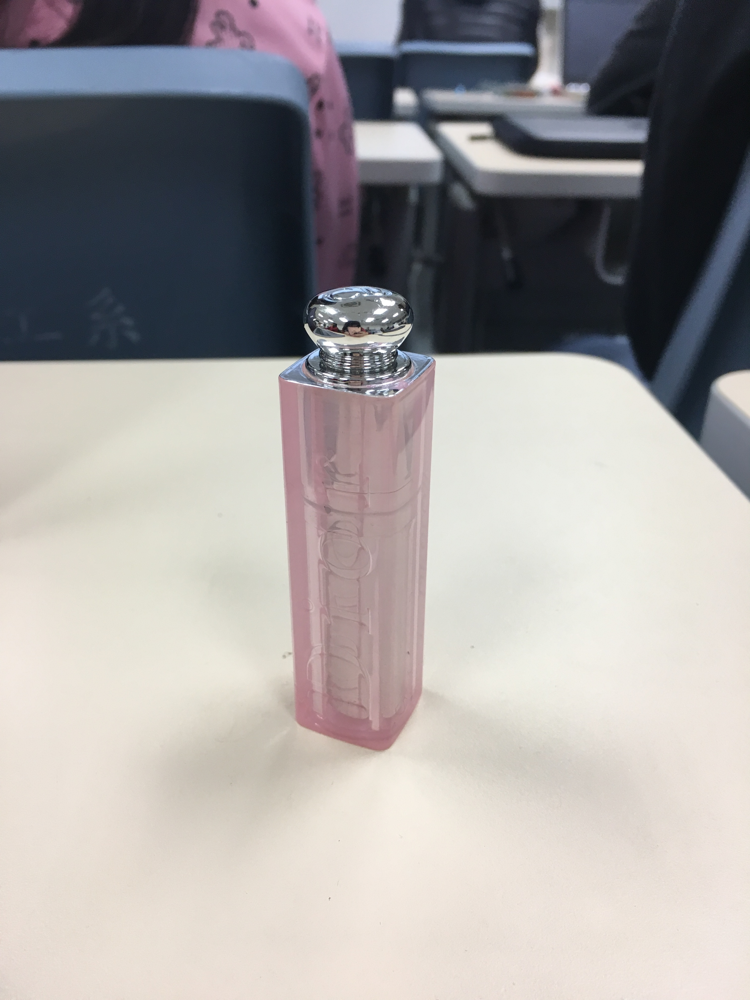
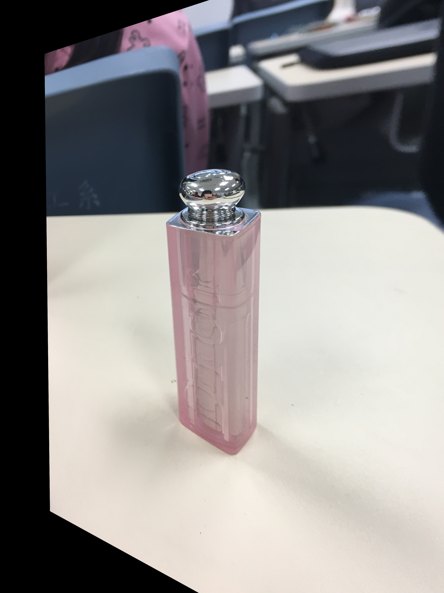

# 2019CVFX_Homework5_Team5

## Motion Parallax
Motion parallax 為利用近景移動速度快，遠景移動速度慢的視覺差異，來讓然感覺到 3D 立體的效果，就好比我們坐在行駛的車上，看遠處的山感覺移動得很慢，但近處的馬路雙黃線就移動得很快。 
在這次作業中，我們可以利用 feature alignment 讓他去 align 前景（物體）或背景，希望能讓它達到前述的效果。 

##### 1.唇蜜 

    
    

##### 2. 籃球場旁的駐警隊監視系統

    
    

### image alignment results & multi-view 3D visual effects

我們所使用的 feature extractor 為 ORB feature extractor
##### 1. 唇蜜

 
首先我們先試了比較簡單的圖像，畫面中很明顯的以唇蜜為我們的主體。在這樣主體跟背景名確的情況下，feature extractor 比較容易抓到主體唇蜜的部分，而不會 align 成後面的背景，所以 align 出來的結果會比較好。

    

 
不過因為我們所拍的圖片在位置上沒有很大的偏移，角度上也都差不多，所以有沒有 alignment 看不出什麼效果。以下為我們實作 feature alignment 與沒有做的比較。 

original            |  image alignment           
:-------------------------:|:-------------------------:
  |  

可以看到，在沒有 align 直接交替變換兩張圖的情況下，就已經有很好的效果。而 align 之後反而導致唇蜜有變形的感覺。

##### 2.

    
    

接下來我們嘗試在戶外有許多背景物體的情況下實作 motion parallax。我們希望可以去 align 前面的監視系統，藉由背景的移動產生 3D 效果。
 
一開始我們將兩張圖片直接放進去作 feature alignment，得到以下的結果 

    

可以看出來，圖片前 20 match 的部分都是後面的樹以及大樓。我們讓他畫出來所有抓到的 features，發現所抓到的 features 皆為後面的樹、大樓以及路邊的腳踏車，完全沒有任何一個 features 抓到中間的箱子。為了能夠順利 align ，我們幫兩張照片增加了 mask，強迫他去 align 中間的箱子。

    

然後我們利用得到的 matches 去計算 homography，然後用來轉換原本的圖片。 
除此之外我們也利用了 PhotoShop 去調整作為比較。以下為不同做法的結果比較。

origin+PhotoShop      |image alignment         |  image alignment+PhotoShop           |  image alignment+mask
:-------------------------:|:-------------------------:|:-------------------------:|:-------------------------:
 |  |  |  

如果純粹使用 PhotoShop，雖然效果還不錯，但是要花很多時間去對準。使用了 image alignment，如果沒有 mask 會導致他的位置上有很大的偏移，但因為有經過 alignment，所以如果再使用 PhotoShop 去調整會節省很多時間。使用了 mask 之後，則完全不需要使用 PhotoShop 去調整大小及位置就可以得到不錯的結果。

## bonus
### Live Photo

Live Photo 是 iPhone 中一個有趣的功能，顧名思義就是一張 「活的照片」，它能夠呈現出宛如影片一般的效果。
它的產生方式是在按下快門的那個瞬間，自動連拍數張照片，如此一來除了可以從中挑選出滿意的照片，
更能製作成動態桌布，或轉成 GIF 方便分享給親朋好友。  

在這次的作業中。我們總共使用三種不同的方式來實作這個特效。第一種是直接使用 iPhone 內建的 Live Photo 功能，
第二種是藉由 google 提供的 Motion Still App，第三種是直接用 feature alignment 的方式實現。

我們將連拍產生的數十張照片利用 feature extractor 分別識別出兩兩相鄰照片中前 500 個 match的點並align成同一張。如此一來，若原本有 n 張照片，
經過兩兩合併，就會得到 n-1 張照片，且他們全部主要的特徵都不會移動。

以下我們將比較用 Live Photo、Motion Still、和 Feature Matching 產生出來的結果，並進行一些分析比較。
我們總共使用四組不同的照片來進行實驗，他們彼此之間的差異性很大。
第一組照片是馬路上機車移動的畫面。照片中物體的移動速度很快、移動距離也很遠。  
第二組照片是校園中樹木被風吹拂的樣子，前景、背景的輪廓不太明顯，不容易識別，且移動的幅度不大。  
第三組是在室內取景，光線較為明亮，景物與相機的距離也很近，跟其他照片的差異在於，移動的是相機，而不是物體本身。  
第四組同樣是在室內拍攝的，前景與背景的區別很大，容易分割。  

| iPhone Live Photo    |  |  |  |  | 
| :--------:           | :--------:                                            | :--------:                                            | :--------:                                            | :--------:                                            |
| **Motion Still**     |  |  |  |  |
| **Feature Matching** |  |  |  |  |

從上面的比較表可以看出來，用 Motion Still 拍出的畫面最穩定，有防手震的功用。它完美地將 iPhone 拍出的背景，改成靜止不動的。
特別像是第一組照片那樣晃動較大的照片，也都能完全align。而我們自己實作的 Live Photo 跟 iPhone 的效果差不多，若是加上一些後製，
或許就能更接近 Motion Still 的水準。